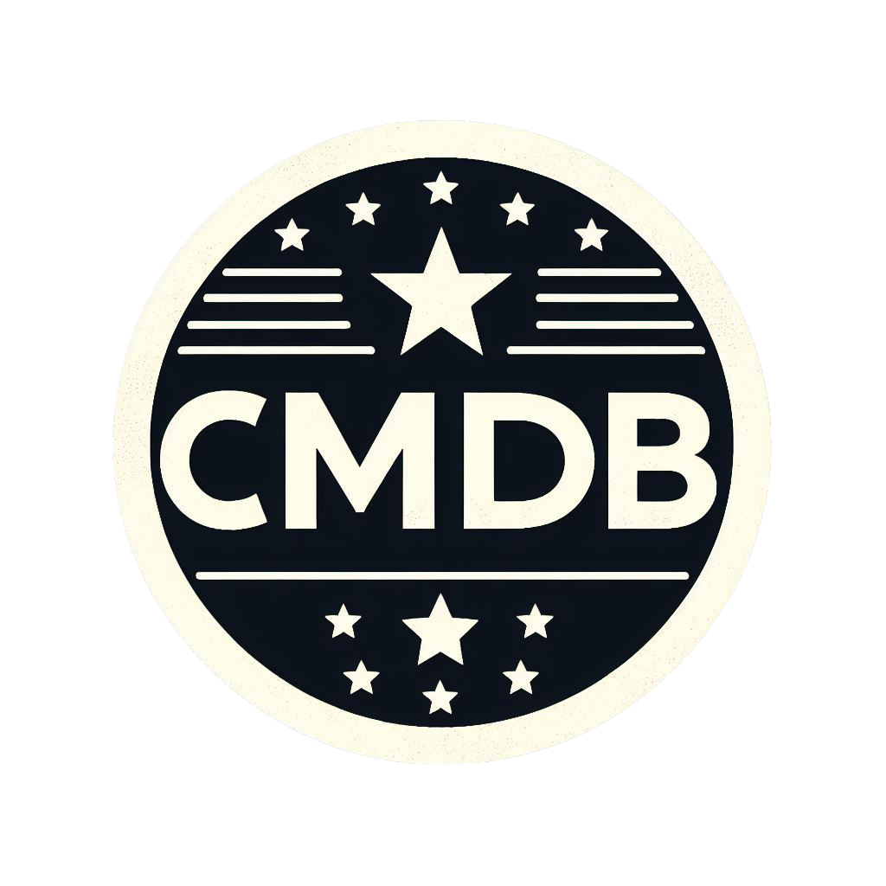

# CMDB Movie Recommendation App



## Overview

The CMDB Movie Recommendation App is a web application designed to help users discover movies based on genre, user ratings, and language preferences. The app leverages The Movie Database (TMDb) API to provide movie recommendations and offers a user-friendly interface for an enjoyable movie-searching experience.

## Features

- **Genre and Rating Filtering:** Users can filter movies based on genres and user ratings.
- **Automatic Recommendations:** The app automatically recommends a random selection of movies from TMDb
- **Pagination:** Users can load more movies with the "Find More Movies" button.
- **Creator's Journey:** Learn more about the creator, Chris Miranda, and the motivation behind developing the app in the "More on CMDB" section.

## Installation

1. Clone the repository:

    ```bash
    git clone https://github.com/ChrisCodeTrials/front-end-portfolio-proj
    ```

2. Navigate to the project directory:

    ```bash
    cd cmdb-movie-app
    ```

3. Open `index.html` in your preferred web browser.

## Usage

1. Open the app in your web browser.
2. Use the form to select a genre, enter a user rating, and choose a language that you prefer.
3. Click the "Find Movies" button to get movie recommendations.
4. Explore the displayed movies, and click "Find More Movies" to load additional recommendations.

## File Structure

- **index.html:** Main HTML file for the movie recommendation app.
- **index.js:** JavaScript file handling movie data fetching and user interactions.
- **style.css:** CSS file for styling the movie recommendation app.
- **aboutUs.html:** HTML file providing more information about CMDB and its creator.
- **aboutUs.css:** CSS file for styling the "More on CMDB" page.
- **apiKey.js:** JavaScript file containing the TMDb API key (not included in the repository).